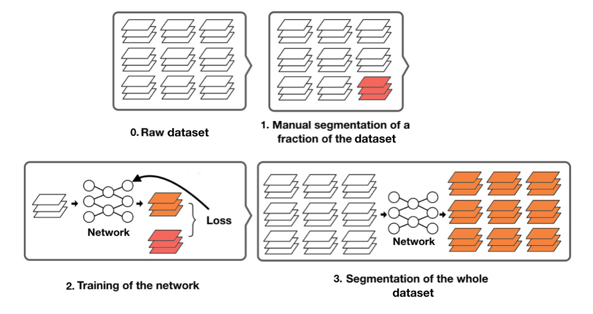
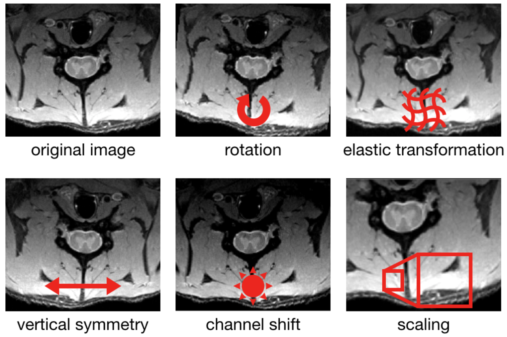

# Multiclass segmentation pipeline


## About

This repo contains a pipeline to train networks for **automatic multiclass segmentation of MRIs** (NifTi files).
It is intended to segment homogeneous databases from a small amount of manual examples. In a typical scenario, the user segments manually 5 to 10 percents of his images, trains the network on these examples, and then uses the network to segment the remaining images. 

## Requirements

The pipeline uses Python 2.7. A decent amount of RAM (at least 8GB) is necessary to load the data during training. Although the training can be done on the CPU, it is sensibly more efficient on a GPU (with cuda librairies installed).


## Installation

Clone the repo: 

``` bash
git clone https://github.com/neuropoly/multiclass-segmentation
cd multiclass-segmentation
```

The required librairies can be easily installed with pip:

``` bash
pip install -r requirements.txt
```

  > Note: To use tensorboard you must also install tensorflow with 
  > ``` pip install tensorflow```

## Data specifications

The pipeline can handle only <b>NifTi</b> (https://nifti.nimh.nih.gov/) images. The images used must share the same resolution and orientation for the network to work properly.
The examples of segmentations (ground truths, GT) to use for training must be binary masks, i.e. NifTi files with only 0 and 1 as voxel values. A GT file must correspond to a raw file and share its dimensions. If multiple classes are defined, a GT file must be generated for each class, and the GT masks must be exclusive (i.e. if a voxel has the value of 1 for one class, it must be 0 for the others).   

## How to use

### 0. Description of the process

This pipeline's purpose is to train a neural network to segment NifTi files from examples.  
Since the training requires example, the first step consists in producing manual segmentations of a fraction of the files. 10 to 50% of the files should be a good proportion, however this sample must be representative of the rest of the dataset. Datasets with great variability might require bigger fractions to be manually segmented.  
The network is trained through a gradient back-propagation algorithm on the loss. The loss quantifies the difference between the predictions of the network and the manual segementations.  
Once trained, the network can be used to automtically segment the entire dataset.

For training and inference, the volumes are sliced along the vertical axis and treated as collections of 2D images. Thus the image processing operations are 2D operations. Data augmentation is used on the training data. It consists in random modifications of the images and their corresponding GT to create more various examples. 




### 1. Register the paths to your data

Rename the *training_data_template.txt* to *training_data.txt* and fill it using the following structure : 

``` 
input <path to file 1> <name of class 1> <path to GT of file 1 for class 1> <name of class 2> <path to GT of file 1 for class 2>
input <path to file 2> <name of class 1> <path to GT of file 2 for class 1> <name of class 2> <path to GT of file 2 for class 2>
```
You can put as many classes as you wish.  
Example :
```
input ./data/subject_1.nii.gz csf ./data/subject_1_manual_csf.nii.gz gm ./data/subject_1_manual_gm.nii.gz wm ./data/subject_1_manual_wm.nii.gz
input ./data/subject_2.nii.gz csf ./data/subject_2_manual_csf.nii.gz gm ./data/subject_2_manual_gm.nii.gz wm ./data/subject_2_manual_wm.nii.gz
input ./data/subject_3.nii.gz csf ./data/subject_3_manual_csf.nii.gz gm ./data/subject_3_manual_gm.nii.gz wm ./data/subject_3_manual_wm.nii.gz
```

Rename the *validation_data_template.txt* to *validation_data.txt* and fill it using the same structure.

The files registered in the *training_data.txt* file will be used to train the network, and the ones in the *validation_data_template.txt* will only be used to compute the loss without modifying the network. This validation dataset is useful to detect overfitting. It is also recommanded to keep some manually segmented data for an evaluation dataset to use after the training for its evaluation. A good rule of thumb is to manually segment 10 % of your dataset and use 70/15/15 % of these manually segmented images for training/validation/evaluation.

### 2. Set the hyper-parameters

Rename the *parameters_template.json* file to *parameters.json* and modify the values with the hyper-parameters you want.  
See the section **Description of the hyper-parameters** below for a complete description of their functions.  
A copy of the *parameters.json* file is added to the folder of the run where the model is saved. 
  
### 3. Activate tensorboard (optional)

Tensorboard is a tool to visualize in a web browser the evolution of training and validation loss during the training.  
In a terminal, type 
```
tensorboard --logdir <path to multiclass-segmentation folder>/runs
```

### 4. Launch training

Execute the *training.py* script.  
You can use the --cuda option to use cuda (thus running on GPU), and the --GPU_id argument (int) to define the id of the GPU to use (default is 0). For example : 
```
python training.py --cuda --GPU_id 5
```

When the training is over, two models are saved in ./runs/\<timestamp>_<machine_name> folder. One is *best_model.pt* and corresponds to the weights giving the smallest loss on the validation dataset, the other is *final_model.pt* and corresponds to the weights at the last epoch. 
  
### 5. Segment new data

To use your trained model on new data, execute the *segment.py* script with the following arguments :
- **--model** (-m) : path to the trained model to use
- **--input** (-i) : path to the file to segment
- **--output** (-o) : path to write the files, "_<class name>_seg" suffixes will be added to the file name. This argument is optional, if not provided, the input path will be used.
- **--tag** (-t) : a tag to add to the output files' names, optional.  

Example : 
```
python segment.py -m ./runs/<timestamp>_<machine_name>/model.pt -i ./inputs/file.nii.gz -o ./outputs/file.nii.gz -t test
```
If the model was trained to segment two classes named gm and wm, two files will be saved :  
./outputs/file_test_gm_seg.nii.gz and ./outputs/file_test_wm_seg.nii.gz.

> Remark : the input files must share the same resolution and orientation as the ones used in training. To check which are these resolution and orientation, you can either check the *parameters.json* file copied in the directory where the model was saved, or use the *show_res_ori.py* script with the --model (-m) argument providing the path to the model, e.g. :
```
python show_res_ori.py -m ./runs/<timestamp>_<machine_name>/model.pt
```

## Description of the hyper-parameters

The hyper-parameters are divided in 4 categories. 

#### 1. Transforms

This category contains the parameters related to the data augmentation. The data augmentation operation is the combination of 5 transformations : rotation, elastic deformation, vertical symmetry, channel shift and scaling. 

  - **flip_rate** (float) : probability to apply the vertical symmetry. Default value is 0.5.
  - **scale_range** (tuple) : range of size of the origin size cropped for scaling. Default value is (0.08, 1.0).
  - **ratio_range** (tuple) : range of aspect ratio of the origin aspect ratio cropped for scaling. Default value is (3./4., 4./3.).
  - **max_angle** (float or tuple) : angle range of the rotation in degrees (if it is a single float a, the range will be [-a,a]).
  - **elastic_rate** (float) : probability of applying the elastic deformation. Default value is 0.5.
  - **alpha_range** (tuple) : range of alpha value for the elastic deformation.
  - **sigma_range** (tuple) : range of sigma value for the elastic deformation.
  - **channel_shift_range** (int) : percentage of the max value to use for the channel shift range (e.g. for a value a, the range of the shiffting value is [-a/100\*max(input),a/100\*max(input)]).
  


#### 2. Training

This category contains the hyper-parameters used to train the network.

  - **learning_rate** (float) : learning rate used by the optimizer
  - **optimizer** (string) : optimizer used to update the network's weights. Possible values are "sgd" for simple gradient descent and "adam" for the Adam optimizer. Default value is "adam".
  - **loss_function** (string) : loss function. Possible values are "crossentropy" for cross-entropy loss and "dice" for the dice loss. Default value is "crossentropy". 
  - **dice_smooth** (float) : smoothing value for the dice loss (unused for cross-entropy loss). Default value is 0.001.
  - **batch_size** (int) : number of images in each batch. 
  - **nb_epochs** (int) : number of epochs to run.
  - **lr_schedule** (string) : schedule of the learning rate. Possible values are "constant" for a constant learning rate, "cosine" for a cosine annealing schedule and "poly" for the poly schedule. Default value is "constant".
  - **poly_schedule_p** (float) : power of the poly schedule (only used for poly learning rate schedule). Default value is 0.9.
  
  > Remark : the poly schedule is defined as follows  
  > λ = (1-i/n)^p  
  where λ is the learning rate, i the number of the current epoch, n the total number of epochs to run and p the parameter *poly_schedule_p*.
 
#### 3. Net

This category contains the the hyper-parameters used to define and parameterize the network model.

  - **model** (string) : architecture model of the network. Possible values are "unet" for the U-Net[1], "smallunet" for a modified U-Net with half less filters and one stage less deep, "segnet" for the SegNet[2] and "nopoolaspp" for the NoPoolASPP[3].
  - **drop_rate** (float) : dropout rate.
  - **bn_momentum** (float) : batch normalization momentum.

#### 4. Input

This category contains the data specifications used to check that all the loaded files share the same specifications, and hyper-parameters to format the data.

  - **data_type** (string) : data type to use in the tensors, e.g. "float32".
  - **matrix_size** (tuple) : size of the center-cropping to apply on every slice. For the models with pooling (SmallUNet and UNet) the sizes should be multiple of 2^p where p is the number of pooling operations (resp. 3 and 4). 
  - **resolution** (string) : resolution in the axial planes. It should be in the following format : "axb" where *a* is the resolution in the left/right axis and *b* in the anterior/posterior axis, e.g. "0.15x0.15".
  - **orientation** (string) : orientation of the files, e.g. "RAI".

 > Remark : the **resolution** and **orientation** parameters are not used during training, their purpose is only to store the resolution and orientation of the files used during training. 

## Citation

If you find this repository useful in your research, please cite the following paper:

```
@ARTICLE{Paugam2019-mf,
  title    = "Open-source pipeline for multi-class segmentation of the spinal
              cord with deep learning",
  author   = "Paugam, Fran{\c c}ois and Lefeuvre, Jennifer and Perone,
              Christian S and Gros, Charley and Reich, Daniel S and Sati, Pascal
              and Cohen-Adad, Julien",
  abstract = "This paper presents an open-source pipeline to train neural
              networks to segment structures of interest from MRI data. The
              pipeline is tailored towards homogeneous datasets and requires
              relatively low amounts of manual segmentations (few dozen, or
              less depending on the homogeneity of the dataset). Two use-case
              scenarios for segmenting the spinal cord white and grey matter
              are presented: one in marmosets with variable numbers of lesions,
              and the other in the publicly available human grey matter
              segmentation challenge [1]. The pipeline is
              freely available at:
              https://github.com/neuropoly/multiclass-segmentation.",
  journal  = "Magn. Reson. Imaging",
  month    =  apr,
  year     =  2019,
  keywords = "MRI; segmentation; deep learning; u-net; cnn; spinal cord;
              marmoset"
}
```

## References

[1] Ronneberger O, Fischer P, Brox T. U-Net: Convolutional Networks for Biomedical Image Segmentation. [arXiv](https://arxiv.org/abs/1505.04597) \[cs.CV] 2015.  
[2] Badrinarayanan V, Handa A, Cipolla R. SegNet: A Deep Convolutional Encoder-Decoder Architecture for Robust Semantic Pixel-Wise Labelling. [arXiv](https://arxiv.org/pdf/1511.00561.pdf) \[cs.CV] 2015.  
[3] Perone CS, Calabrese E, Cohen-Adad J. Spinal cord gray matter segmentation using deep dilated convolutions. Sci. Rep. 2018;8:5966. [arXiv](https://arxiv.org/pdf/1710.01269.pdf)
